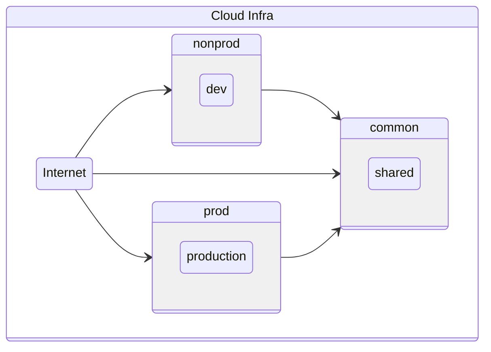

# The Catalyst Squad Infrastructure Philosophy

Catalyst Squad has a few overarching theories about how to break up an infrastructure for internal engineers to utilize, and the associated implications for reliability, security, and self-service of devs.

At a very high level, Software Engineers are responsible for everything having to do with their services. This is normal for modern Software Engineering teams, and often those teams rely on services from other teams in addition. This is fine and good, and the first thing internal teams must provide is some sort of infrastructure.

Specifically, there will be some sort of Cloud Infrastructure, even if it's in a company managed datacenter. The concept is the same, there is a platform of resources. It should be broken up into three "accounts" or "sets" of resources. Edge cases are not in scope of this document. The diagram here describes this state:

## The three highest level environments

When considering high level environments, it's about blast radius and customer data access. A key to thinking in Cloud Native is not to name things. Conceptually, any time you run something, there is only the version of the thing and the data it runs against. Those are the lego bricks we have. You could potentially run 3 different versions of a thing against the same data.

If you name something "dev" and "staging" these may have meaning to you, but they are incorrect to others. Instead, we want to think about the purpose of a run and keep things ephemeral as much as possible.

### Nonprod

Nonprod is for any code that doesn't have access to customer data. It could have access to a scrubbed copy of customer data, but ultimately it is for a bifurcation. Anything in nonprod is something that can be handled during normal hours if it is broken for some reason, but it can be used like any other system setup otherwise. There is one caveat.

Anything in nonprod should be exactly the same as it would be in prod, unless it is an experiment like a spike, and temporary. You use the same resource types (perhaps smaller sizes, but same type), the same deployment mechanisms, everything. You can have more access than to prod, but you shouldn't need it. That's what your local setup is for, perhaps running against a [sandbox](#honorable-mention-sandbox) cloud account.

So again, nonprod is the place for versions of things that don't have access to customer data.

### Prod

Prod might sound like "production" in the same way nonprod might sound like "dev" but again, this is not a good way to think of it. Break yourself of this habit. Production is the environment that has access to customer data, and must be meeting SLOs. Thus, this is the environment people get woken up at 3 AM on a Saturday to fix.

It should be in every way possible exactly the same Infrastructure as Code and deployment mechanisms as nonprod. The only difference should be urls and secrets/keys.

A key ingredient here is that no code of any kind should have any logic or even knowledge of the fact that it's in either prod or nonprod. You might have a different log level, but that's the extent of configuration changes that would affect inputs/outputs.

### Common

In normal scenarios, prod and nonprod should never talk to each other. There should never be a need. Catalyst Squad has yet to hear of a scenario where this is the case. There are always some cases where they need to share resources though. For instance, everything, regardless of how we situate things, shares the same DNS system. This is more important for things that you manage from, such as asset management.

The common environment is for things that both prod and nonprod should be sharing and thus also isolated from. If you have docker images or library assets or anything of that nature, they go in common. If you want to store logs and metrics, it should not reside with the environment it is monitoring, it goes in common.

There is a scenario that trips people up here. Often times configuration is desired to be copied down from prod to nonprod. This is a mistake. Configuration should be obtained in the same mechanism in both prod and nonprod. Store configuration in common, and copy it down to both.

Common is typically owned by platform engineering, or whatever it is called in a given org. It is not accessed by the rest of software engineering except through the APIs given.

### Honorable mention: Sandbox

Sometimes, an environment is provided for playing around and learning. It is often a fairly wild west. If this is desired, that is fine, but it should not be in any of the other three. It should be isolated just like the homelab would be. A separate cloud account, an entirely separate rack, whatever needs be.

A sandbox is mentioned here because it comes up often enough. It is not part of the Catalyst Squad's platform thinking directly.

## Above Infra

This is all fine and good, but for most software engineers, this is setup for them and maintained by another group. There are two layers above this. One is the [platform](platform.md) and the next is the [Minimum Viable Kubernetes Cluster](mvkube.md)
