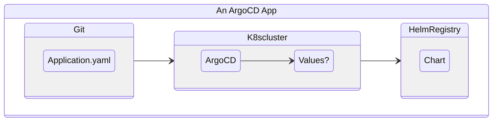
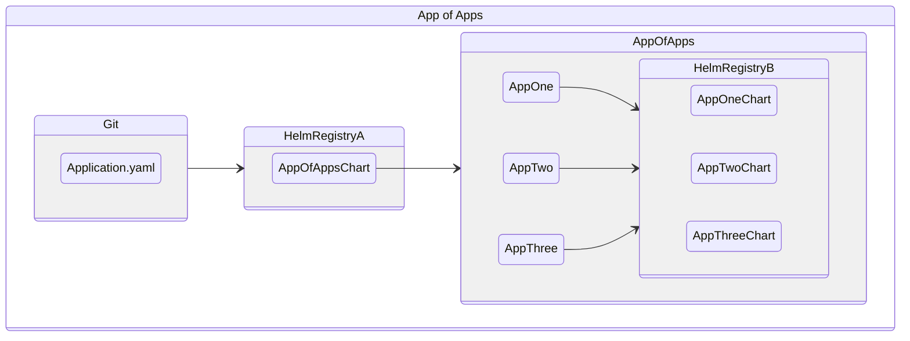

# The Catalyst Squad Minimum Viable Kubernetes Platform

On top of the [Infrastructure](infrastructure.md) layer of the Catalyst Squad Platform sits Kubernetes. There is at least one cluster in each cloud environment, nonprod, prod, and common.

All logs and metrics are sent to common. Common will also have services that nonprod and prod need that will be unique to every use case. However, aside from this, all clusters will at a minimum provide the following services (either from the cloud provider or our base configuration):

- [Cluster Autoscaler](https://github.com/kubernetes/autoscaler)
- [Metrics Server](https://github.com/kubernetes-sigs/metrics-server)
- [External-DNS](https://github.com/kubernetes-sigs/external-dns)
- [Cert Manager](https://github.com/cert-manager/cert-manager)
- [Sentry (in Common)](https://github.com/getsentry/sentry)
- [Prometheus](https://github.com/prometheus/prometheus)
- [Loki](https://github.com/grafana/loki)
- [Grafana](https://github.com/grafana/grafana)
- [ArgoCD](https://github.com/argoproj/argo-cd)
- [An Ingress Controller (currently Contour)](https://github.com/projectcontour/contour)
- [LinkerD](https://github.com/linkerd/linkerd2)
- [PVC Autoresizer](https://github.com/topolvm/pvc-autoresizer)
- [FusionAuth if Needed](https://github.com/FusionAuth)

## How it is organized

The infrastructure layer is created through Infrastucture as Code. Currently we're using Terraform to do this.

Terraform is also used to install ArgoCD. After that, everything else is installed with an [ArgoCD App of Apps](https://argo-cd.readthedocs.io/en/stable/operator-manual/cluster-bootstrapping/) we maintain a [helm chart](https://github.com/catalystsquad/chart-platform-services/) for.

Once deployed, the helm chart installs all the ArgoCD Applications for each of the core platform services, hence the name.

That's it, that's all there is to the kubernetes platform. Create a cluster with whatever means needed, install ArgoCD, and install the services chart. ArgoCD will pull the needed charts from their sources and install things to the cluster.

We now have a strong basis to deploy to in a modern development workflow.

## App of Apps Visualized

App of Apps is often a lot of layers to keep track of to newcomers, so this visual diagram may help. Let's discuss it:

An ArgoCD Application is applied to a Kubernetes cluster. ArgoCD is an operator that watches for changes to those Application Custom Resources, and will sync the resulting manifests to the Kubernetes cluster. In our case, we use Helm to manage the resulting manifests. ArgoCD will go to a Helm Registry and pull down the chart we told it to at the version range we specified. It will then apply Values to that chart just like any other helm usage would. It's worth noting that ArgoCD is just running `helm template` with the chart and values, it is not doing a full helm install. ArgoCD owns the resources and their lifecycle, not Helm.

We add one more layer here. Note that Helm Registry A and B could be the same registry, but they need not be, and often an App of Apps will reference many other helm registries for any other third party software being installed. An app of apps pattern uses these layers to version and package a set of services and control their joint configuration. This allows us to provide things like a common domain in one templating group that can be passed through correctly without the human configuration problem of having to remember all the places we would have to update such a thing.

To deploy an app of applications, you need a chart that is the App of Apps, you need any other charts that you will deploy as individual services, and you kick it all off with one manifest while letting ArgoCD handle the rest:

- You deploy an application.yaml that is a single ArgoCD Application
- That downloads a chart (the app of apps chart) and applies values to it
- The chart contains a bunch of ArgoCD Applications, so from one ArgoCD Application, many others are created, managed by the core Application's configuration
- The Apps each pull down a chart from a registry and applies values to it (passed down from the parent chart, the app of apps chart)

Now you have the benefit of building services independently and still managing their configuration in a cohesive package. There's a lot of advantages in maintaining and upgrading software in this packaged form. It's a lot to think about differently the first time, but it becomes second nature as you are simply automating what you would be doing anyway. If you had a bunch of individual applications, now you have to manage their configuration in just as many repos and their upgrade cycles are not coordinated at all. As an example, you can update a URL to a service you replaced in all places it is needed without forgetting a repo or having to manage the lifecycle of each dependent service.
